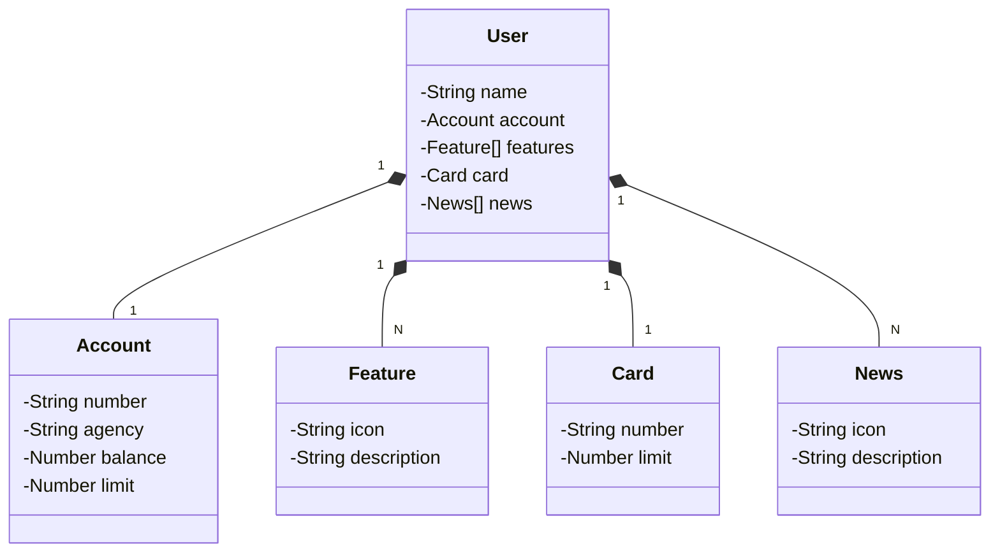

# Java RESTFul API criada para a Santander Dev Week 2023

[Link do protótipo da tela no Figma](https://www.figma.com/file/0ZsjwjsYlYd3timxqMWlbj/SANTANDER---Projeto-Web%2FMobile?type=design&node-id=1421%3A432&mode=design&t=6dPQuerScEQH0zAn-1) que foi baseado para criação do projeto.

### Diagrama UML de Classes (Domínio da API)

### Tecnologias:
- [Java 17](https://www.oracle.com/java/technologies/javase/jdk17-archive-downloads.html)
- [Spring Boot 3.1.2](https://spring.io/blog/2023/07/20/spring-boot-3-1-2-available-now)
- [Spring Data JPA](https://spring.io/projects/spring-data-jpa)
- [Gradle 8.13](https://gradle.org/releases/#8.13)
- [Swagger](https://swagger.io/)
- [Railway](https://railway.com/)
